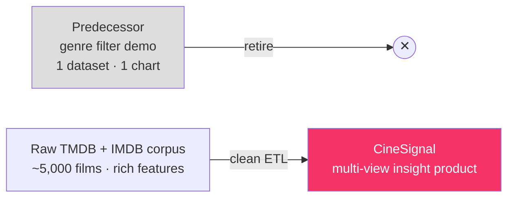
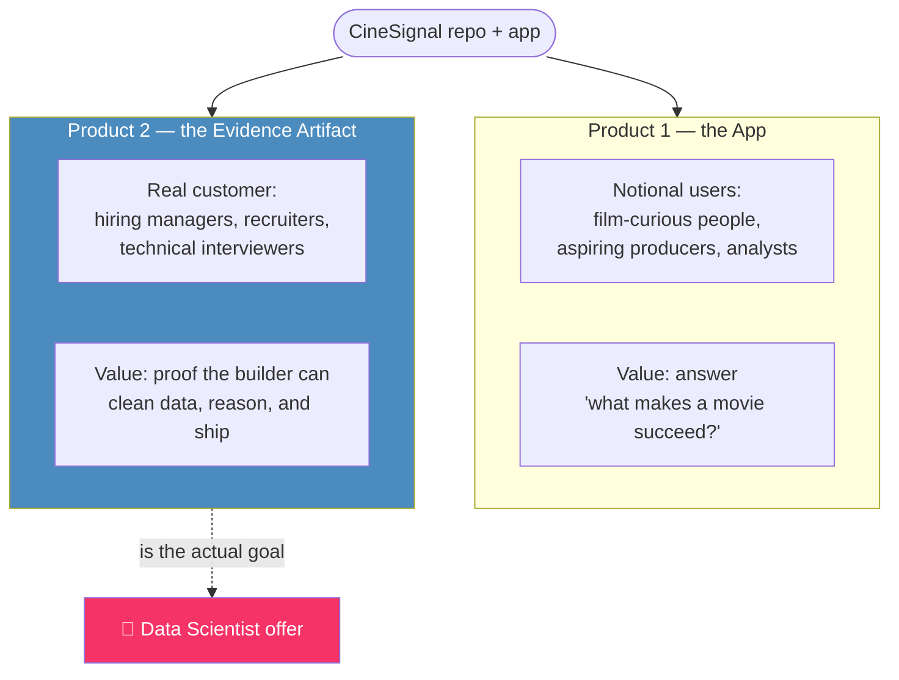
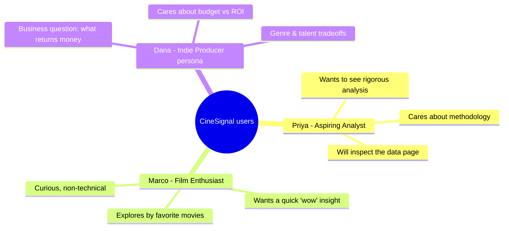
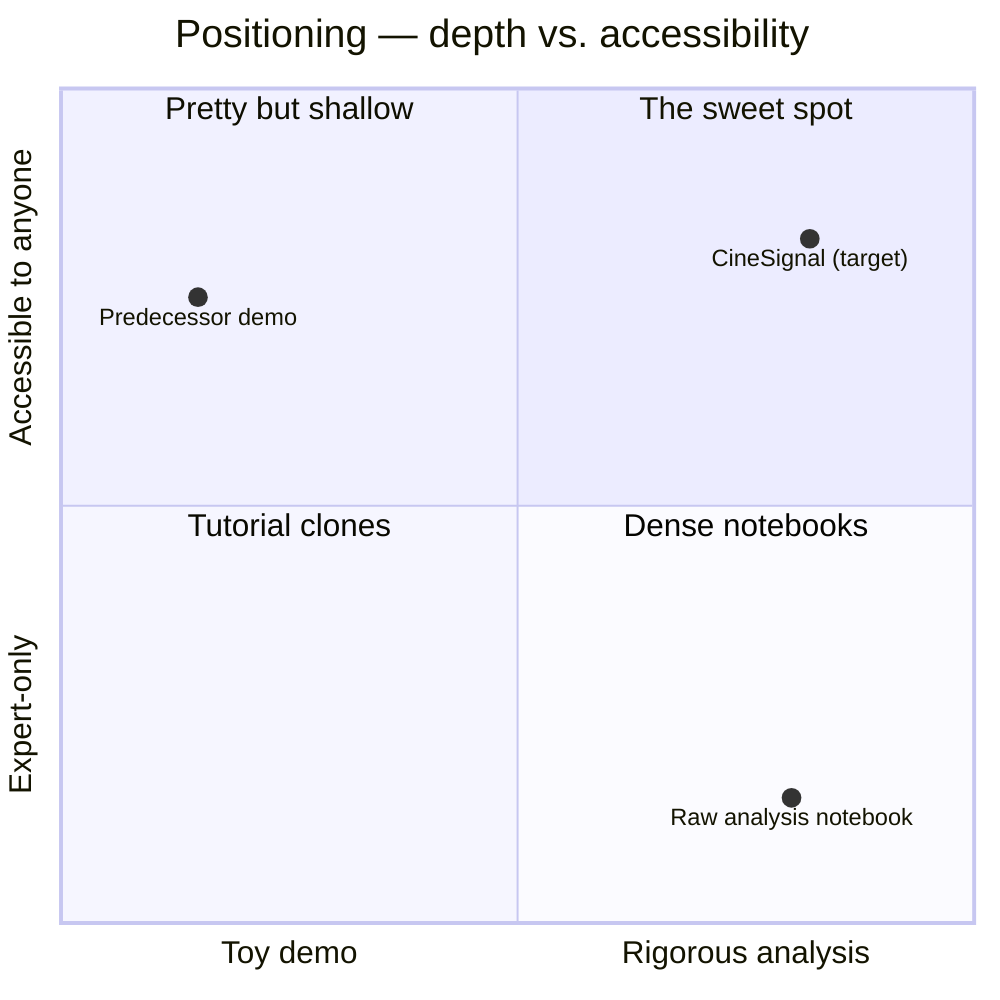
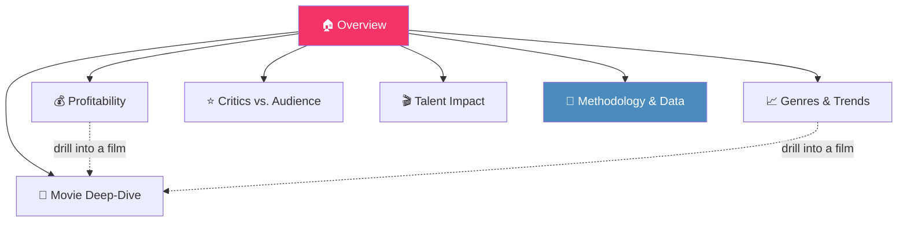
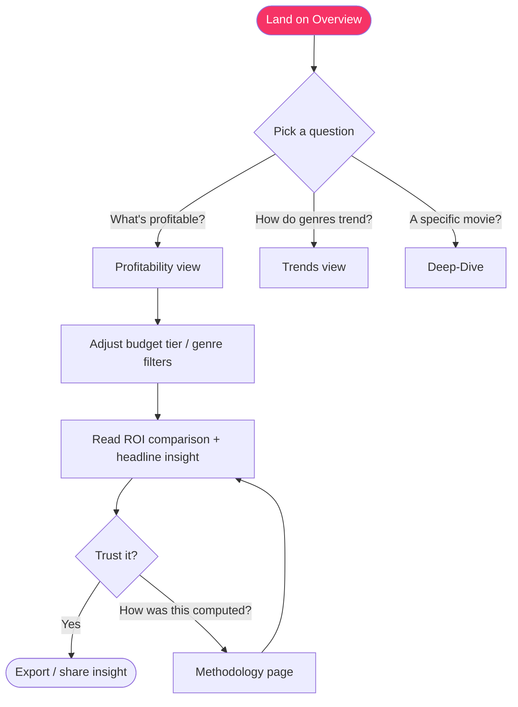
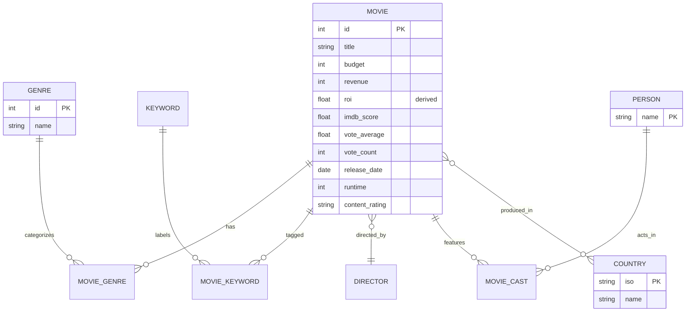
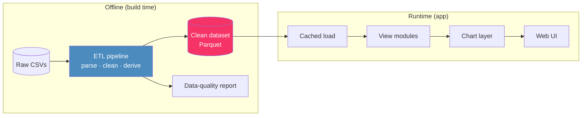
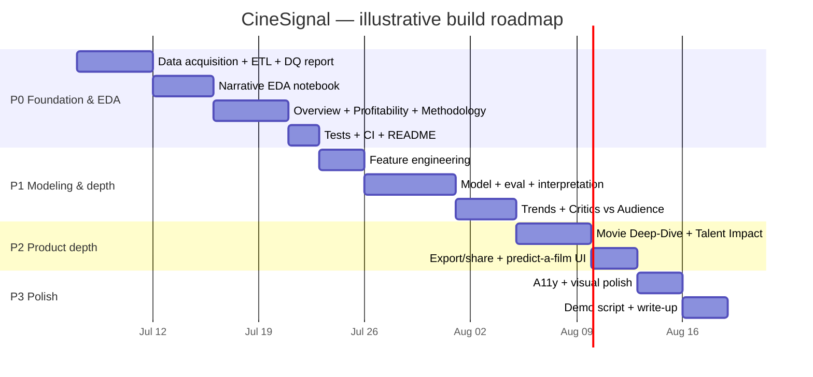

# 📄 Product Requirements Document — **CineSignal**
### Movie Success Intelligence — a portfolio-grade interactive analytics product

> _Working title: **CineSignal**. Alternatives: "Box Office IQ", "CineMetrics", "GreenlightLens". Final name is an [open decision](#17-open-questions--decisions-needed)._

> **🎯 Target role: Data Scientist.  📌 This PRD is a self-contained brief** — it is designed to be the *only* file that survives this project. The predecessor code, the analysis doc, and the raw data files are all expected to be deleted; a fresh Claude Code session should be able to build CineSignal from this document alone. **Start at [§0](#0-how-to-use-this-document-fresh-session-bootstrap).**

---

## Document Control

| Field | Value |
|---|---|
| **Document type** | Product Requirements Document (PRD) |
| **Product** | CineSignal — Movie Success Intelligence |
| **Author** | Senior Product Manager (acting) |
| **Status** | Approved direction v1.1 — target role resolved |
| **Target role** | **Data Scientist** — modeling, statistics & interpretation are core deliverables |
| **Intended usage** | **Self-contained brief.** Designed to be the *sole surviving artifact*; predecessor code, the analysis doc, and raw data files are expected to be deleted. A fresh Claude Code session should build the project from this file alone |
| **Last updated** | 2026-07-04 |
| **Related docs** | None required. `CODEBASE_ANALYSIS.md`, if present, is historical only and may be deleted |
| **Predecessor** | A 53-line Streamlit genre-filter demo — retired, not extended; assume it no longer exists |

**Revision history**

| Version | Date | Author | Change |
|---|---|---|---|
| 0.1 | 2026-07-04 | PM | Initial skeleton |
| 1.0 | 2026-07-04 | PM | First complete draft |
| 1.1 | 2026-07-04 | PM | Target role resolved (Data Scientist); modeling & EDA promoted to core; document made self-contained for a fresh session |

---

## Table of Contents

0. [How to Use This Document (Fresh-Session Bootstrap)](#0-how-to-use-this-document-fresh-session-bootstrap)
1. [TL;DR](#1-tldr)
2. [Background & Context](#2-background--context)
3. [The Dual-Product Framing](#3-the-dual-product-framing)
4. [Goals & Non-Goals](#4-goals--non-goals)
5. [Success Metrics](#5-success-metrics)
6. [Target Users & Personas](#6-target-users--personas)
7. [Product Vision, Positioning & Principles](#7-product-vision-positioning--principles)
8. [The Core Analytical Questions](#8-the-core-analytical-questions)
9. [Scope & Prioritization](#9-scope--prioritization)
10. [Information Architecture & Key Screens](#10-information-architecture--key-screens)
11. [Detailed Functional Requirements](#11-detailed-functional-requirements)
12. [Data Requirements & Data Model](#12-data-requirements--data-model)
13. [Non-Functional Requirements](#13-non-functional-requirements)
14. [Technical Considerations](#14-technical-considerations)
15. [Analytics, Instrumentation & Methodology Transparency](#15-analytics-instrumentation--methodology-transparency)
16. [Risks, Assumptions & Dependencies](#16-risks-assumptions--dependencies)
17. [Open Questions & Decisions Needed](#17-open-questions--decisions-needed)
18. [Release Plan & Roadmap](#18-release-plan--roadmap)
19. [Appendices](#19-appendices)

---

## 0. How to Use This Document (Fresh-Session Bootstrap)

**This PRD is written to be self-sufficient.** It is intended to survive as the *only*
artifact from this project — the predecessor app, the analysis doc, and even the raw data
files are expected to be deleted. A fresh Claude Code session (or any engineer) should be
able to build **CineSignal** from this document alone, with no prior conversation context.

To make that possible, this document carries everything needed to start cold:

- The product thesis, scope, and priorities → [§1–§9](#1-tldr)
- Full feature specs with acceptance criteria → [§11](#11-detailed-functional-requirements)
- **What data the product needs** — the required fields; the specific dataset & source are a
  **project decision**, not prescribed here → [§12](#12-data-requirements--data-model) & [Appendix A](#appendix-a-data-dictionary)
- Recommended stack, repo structure, and DS deliverables → [§14](#14-technical-considerations)

### 0.1 Target-role decision (resolved)

The builder is targeting a **Data Scientist** role. This resolves the biggest open question
([OQ2](#17-open-questions--decisions-needed)) and shifts the project's center of gravity:

- **Modeling, statistical rigor, and interpretation are core deliverables — not stretch.**
- A polished, reproducible **narrative EDA notebook** is a first-class artifact; DS
  evaluators will read it before they touch the app.
- The web app is the **delivery vehicle** for insight, not the main event. It must exist and
  be clean, but **depth of analysis outranks UI breadth.**

### 0.2 Suggested kickoff prompt for a fresh Claude Code session

Paste something like this to bootstrap the build:

> _"Read `PRD.md` in full — it is the complete brief for a Data Scientist portfolio project
> called CineSignal. Then begin **Phase 0**: (1) scaffold the repo per §14.3, (2) help me
> **decide on a data source** per §12 — it is deliberately open, so recommend a few options
> with trade-offs and wait for my choice before wiring it up, (3) build the ETL pipeline +
> data-quality report per FR-1, and (4) produce the narrative EDA notebook per FR-0. Ask me
> about the decisions still open in §17, and give a recommendation for each. Do **not** build
> the predictive model until the ETL and EDA have been reviewed."_

### 0.3 What NOT to assume is present

- ❌ **No data in the repo** → a data source must be **chosen** and wired up (see [§12](#12-data-requirements--data-model); the choice is deliberately open).
- ❌ **No predecessor code** to reference or reuse.
- ❌ **No prior conversation / analysis docs** → this file is the single source of truth.

> If any statement in this PRD ever conflicts with leftover files in the repo, **this PRD
> wins** — the files are legacy and slated for deletion.

---

## 1. TL;DR

**CineSignal** is an interactive web application that answers one deceptively simple
question — **"What actually makes a movie successful?"** — by letting users explore the
relationships between a film's **budget, genre, talent, ratings, and box-office
performance** across ~5,000 films.

It replaces a trivial genre-filter demo with a focused **analytics product** that produces
*insights*, not just filtered tables. It is deliberately designed as a **portfolio
project**: every decision is made to demonstrate, to a hiring manager, that the builder can
take messy raw data, clean it rigorously, answer a real business question, and ship a
polished, correct, well-engineered product.

**What we're building:** a multi-view analytics app (Overview → Profitability → Genres &
Trends → Critics vs. Audience → Talent Impact → Movie Deep-Dive → Methodology), backed by a
documented ETL pipeline and, in a later phase, a lightweight predictive "success score."

**Why it matters:** the current predecessor proves the builder can follow a tutorial;
CineSignal proves the builder can *think*. That difference is the entire point.

---

## 2. Background & Context

### 2.1 The predecessor

The existing repository (`movies-explorer`) is a fork of a well-known public Streamlit
tutorial (the "Data Professor" template). It renders a single line chart of gross earnings
by genre and year. Its limitations — the reason for a rebuild — were, in summary:

- It uses **1 of 4 available datasets**; ~75% of the data (budget, ratings, cast, country,
  keywords) is unused.
- It **poses** the question "what makes a movie successful?" in its README but never
  answers it.
- It carries visible defects (an out-of-range year slider, no caching, no tests) and a git
  history authored entirely by the original tutorial author.

### 2.2 The raw material

CineSignal needs a **film-level dataset** covering financials (budget, revenue), reception
(critic + audience scores), genre, talent, and content attributes across a few thousand
films. Public datasets of exactly this shape exist; **the specific choice of dataset and how
it is obtained is a project decision** ([OQ8](#17-open-questions--decisions-needed)), not fixed
here. See the [Data Requirements](#12-data-requirements--data-model) and
[Appendix A](#appendix-a-data-dictionary) for the fields the product relies on. The analytical
challenge lives in **cleaning and interpreting** the data — exactly the skill we want to
showcase.

### 2.3 Why rebuild rather than extend

A rebuild is warranted (not merely a refactor) because:

1. The product **thesis changes** — from "filter genres" to "explain success."
2. The **information architecture** changes — from one view to a multi-view analytical
   narrative.
3. The **authorship** must change — clean git history, original README, the builder's name.



---

## 3. The Dual-Product Framing

This is the central strategic idea of the PRD. A portfolio project has **two products and
two customers**, and requirements must satisfy both.



**Design implication:** when a feature helps notional users but not evaluators (or vice
versa), we bias toward the **evaluator**, because the evaluator is the real customer. This
is why "Methodology & Data-Quality transparency" is a first-class feature (§11.7) even
though a casual app user might skip it — a hiring manager will read it first.

---

## 4. Goals & Non-Goals

### 4.1 Goals

| # | Goal | Serves |
|---|---|---|
| G1 | Answer "what drives movie success?" with defensible, data-backed insights | App + Evaluator |
| G2 | Demonstrate end-to-end **DS** competence: data acquisition → ETL → EDA → **modeling & interpretation** → app → deployment | Evaluator |
| G3 | Be **correct** — no misleading aggregations, documented caveats | Both |
| G4 | Be **usable** — a non-analyst can reach an insight in < 60 seconds | App |
| G5 | Be **legible to a reviewer** — clean repo, clear README, readable code | Evaluator |
| G6 | Be **defensible in an interview** — every choice has a stated rationale | Evaluator |
| G7 | Demonstrate **statistical rigor** — claims backed by tests/effect sizes; modeling free of leakage | Evaluator |

### 4.2 Non-Goals

| # | Non-Goal | Rationale |
|---|---|---|
| N1 | Real-time / live movie data ingestion | Static historical corpus is sufficient; live pipelines add ops risk with no portfolio upside |
| N2 | User accounts, auth, personalization | No user base; pure overhead |
| N3 | Recommending movies to watch | Different product; dilutes the "success drivers" thesis |
| N4 | Beating a research-grade box-office prediction model | We showcase *sound* modeling, not SOTA accuracy |
| N5 | Mobile-native apps | Responsive web is enough |
| N6 | Covering every genre/era equally | Data is US/English-skewed; we scope honestly rather than overreach |

---

## 5. Success Metrics

Because CineSignal has no real user base, **traditional product metrics (DAU, retention)
do not apply.** We define two metric families matching the [dual framing](#3-the-dual-product-framing).

### 5.1 Product-quality metrics (the App)

| Metric | Target | How measured |
|---|---|---|
| Time-to-first-insight | < 60 s for a new visitor | Moderated usability test (5 users) |
| Insight correctness | 0 misleading defaults; all caveats surfaced | Self-audit + peer review against methodology page |
| Task completion | 90% of testers can answer "which genre is most profitable?" unaided | Usability test |
| Interaction responsiveness | < 300 ms perceived on filter change | Manual + cached-load timing |
| Accessibility | WCAG AA color contrast; keyboard navigable | Automated checker + manual pass |

### 5.2 Portfolio-impact metrics (the Evidence Artifact)

| Metric | Target | How measured |
|---|---|---|
| Reviewer time-to-comprehension | A reviewer understands what/why in < 3 min from README | Peer feedback |
| Interview talkability | Builder can speak 10+ min on tradeoffs made | Self-assessment / mock interview |
| Repo hygiene signals | Tests pass in CI, clean commit history authored by builder, LICENSE present | Repo inspection |
| Callback lift (leading indicator) | Project cited positively in ≥1 interview | Post-application tracking |
| Public signal (optional) | GitHub stars / LinkedIn post engagement | Platform analytics |

> **Anti-metric:** we explicitly **do not** optimize for feature count. A smaller product
> that is correct and well-explained beats a sprawling one with shaky analysis.

---

## 6. Target Users & Personas

### 6.1 App personas (Product 1)



| Persona | Role | Primary JTBD | Success looks like |
|---|---|---|---|
| **Priya** | Aspiring data analyst (proxy for evaluator) | "Show me the analysis is sound." | Reads methodology, trusts the numbers |
| **Marco** | Film enthusiast, non-technical | "Give me a surprising, shareable fact." | Reaches a fun insight in seconds |
| **Dana** | Indie-producer persona | "What kinds of films actually make money?" | Compares ROI across budget tiers & genres |

### 6.2 The real customer (Product 2)

| Persona | Role | What they evaluate | What convinces them |
|---|---|---|---|
| **Sam** | Hiring manager / senior analyst | Can this person reason with data and ship? | Correct analysis + honest caveats + clean repo |
| **Riya** | Technical interviewer | Depth beneath the surface | Documented ETL, tests, defensible tradeoffs |
| **Alex** | Recruiter (non-technical) | Is this legit and clear? | Polished live demo + a crisp README story |

---

## 7. Product Vision, Positioning & Principles

### 7.1 Vision statement

> **CineSignal turns a raw pile of movie data into a clear answer to the question every
> studio asks — "what makes a film succeed?" — and does it transparently enough that you
> trust every number on the screen.**

### 7.2 Positioning



CineSignal aims for the top-right: **rigorous *and* accessible** — the quadrant where a
non-analyst gets value and an analyst respects the method.

### 7.3 Product principles

1. **Insight over interaction.** A widget that produces no insight is cut. Every view
   states its takeaway in words, not just pixels.
2. **Correct by default.** No default that misleads (e.g. no summing gross across genres
   without a warning). The safe reading is the default reading.
3. **Show your work.** Data cleaning and assumptions are a visible product feature, not a
   hidden notebook.
4. **Progressive depth.** Marco gets a headline; Priya can drill into the method behind it.
5. **Honest scope.** We state the data's biases (US/English skew, ~2016 vintage) rather
   than pretend generality.
6. **Legible engineering.** The code is part of the product; it is written to be read.

---

## 8. The Core Analytical Questions

The product is organized around a small set of high-value questions. Each maps to a view
and to concrete insights we commit to delivering.

| # | Question | Maps to view | Example insight we must be able to produce |
|---|---|---|---|
| Q1 | What does the corpus look like? | Overview | "5k films, 1916–2017, 79% USA, budgets from $X–$Y" |
| Q2 | What is **profitable**, not just high-grossing? | Profitability | "Horror has the best median ROI; big-budget ≠ best return" |
| Q3 | How do genres perform and trend over time? | Genres & Trends | "Sci-Fi revenue share rose 3× post-2000" |
| Q4 | Do critics and audiences agree, and does it matter? | Critics vs. Audience | "Audience-loved / critic-panned films still profit" |
| Q5 | Does star/director power move the box office? | Talent Impact | "Top-decile director films earn N× median" |
| Q6 | What's the story of a *specific* film? | Movie Deep-Dive | Per-film scorecard vs. genre benchmarks |
| Q7 | Can we *predict* success? _(later phase)_ | Success Score | "Model explains R² of revenue variance; top drivers are…" |

**Key correctness stance:** "success" is **multi-dimensional**. We explicitly separate:
- **Revenue** (gross box office),
- **Profitability** (ROI = (revenue − budget) / budget),
- **Reception** (ratings),
and never let one masquerade as another. This distinction is itself a portfolio talking
point.

---

## 9. Scope & Prioritization

### 9.1 MoSCoW

| Priority | Items |
|---|---|
| **Must** | Data-acquisition step; ETL pipeline + clean dataset + data-quality report; **narrative EDA notebook**; Overview; Profitability explorer; Genres & Trends; **Success-Score model (documented, honest, leakage-free)**; Methodology page; responsive UI; caching; README; tests + CI |
| **Should** | Critics vs. Audience view; Movie Deep-Dive; feature-importance / interpretation view; download/export; shareable state |
| **Could** | Talent Impact view; keyword/NLP exploration; interactive "predict a hypothetical film" UI |
| **Won't (v1)** | Live data; auth; recommendations; mobile-native |

### 9.2 RICE-style ranking (relative)

| Feature | Reach | Impact | Confidence | Effort | Priority |
|---|:---:|:---:|:---:|:---:|:---:|
| ETL + clean dataset | High | High | High | Med | **P0** |
| **EDA notebook (narrative)** | High | High (evaluator) | High | Med | **P0** |
| Methodology/transparency page | Med | High (evaluator) | High | Low | **P0** |
| Profitability (ROI) explorer | High | High | High | Med | **P0** |
| Overview dashboard | High | Med | High | Low | **P0** |
| **Success-Score model + interpretation** | Med | High (evaluator) | Med | High | **P1 (core for DS)** |
| Genres & Trends | High | Med | High | Low | **P1** |
| Critics vs. Audience | Med | Med | Med | Low | **P1** |
| Movie Deep-Dive | Med | Med | Med | Med | **P2** |
| Talent Impact | Med | Med | Med | Med | **P2** |

### 9.3 What "done" means for v1 (MVP definition)

A visitor can, unaided: understand the dataset, compare **profitability** across genres and
budget tiers, see genre trends over time, and read exactly how the numbers were computed —
all in a fast, accessible, deployed app, from a repo that a reviewer finds clean and
trustworthy. **For the DS evaluator specifically, v1 also ships a narrative EDA notebook and
a documented, leakage-free predictive model** — these are the primary evidence artifacts and
are part of the v1 Definition of Done, not deferred.

---

## 10. Information Architecture & Key Screens

### 10.1 Sitemap



### 10.2 Global layout conventions

- **Left sidebar:** view navigation + persistent global filters (year range, genre,
  budget tier, country) where applicable.
- **Main pane:** a *headline insight sentence* at the top of every view, then the
  visualization(s), then a "how to read this" affordance.
- **Footer:** data vintage, source attribution, link to Methodology, builder credit.

### 10.3 Primary user flow



### 10.4 Screen sketches (textual wireframes)

**Overview**
```
┌───────────────────────────────────────────────┐
│  CineSignal — What makes a movie succeed?       │
│  [Headline: "4,721 films · 1916–2017 · US 79%"] │
│  ┌──────┐ ┌──────┐ ┌──────┐ ┌──────┐            │
│  │Films │ │Median│ │Median│ │ Best │  ← KPI row │
│  │4,721 │ │ROI…  │ │Score │ │Genre │            │
│  └──────┘ └──────┘ └──────┘ └──────┘            │
│  [ Budget vs Revenue scatter, log-log ]         │
│  [ Films-per-year bars + data-coverage note ]   │
└───────────────────────────────────────────────┘
```

**Profitability**
```
┌───────────────────────────────────────────────┐
│  Headline: "Horror returns the most per $ spent"│
│  Filters: [Year][Genre][Budget tier][Min votes] │
│  [ Box/violin plot: ROI distribution by genre ] │
│  [ Table: genre · n · median ROI · median gross]│
│  ⚠ note: ROI excludes films with budget/rev = 0 │
└───────────────────────────────────────────────┘
```

_(Remaining views follow the same pattern: headline → filters → chart(s) → caveat.)_

---

## 11. Detailed Functional Requirements

Each feature is specified with a **user story** and **acceptance criteria** in
Given/When/Then form. IDs are stable references for the backlog.

### 11.0 FR-0 — Exploratory Data Analysis notebook `[P0 · core DS signal]`

> **As** Sam/Riya (DS evaluators), **I want** a clean, narrative EDA notebook, **so that** I
> can see the builder's analytical reasoning — not just a finished app.

**Acceptance criteria**
- **AC-0.1** — A reproducible notebook loads the clean dataset and walks through
  distributions, missingness, correlations, and outliers.
- **AC-0.2** — Findings are written as **markdown narrative**, not bare code cells — every
  chart has an explicit takeaway sentence.
- **AC-0.3** — Statistical claims are **supported** (correlation coefficients, group
  comparisons / hypothesis tests, effect sizes) rather than eyeballed.
- **AC-0.4** — The notebook **motivates** the downstream feature engineering and modeling
  choices (it is the bridge from data to model).
- **AC-0.5** — It runs top-to-bottom without errors from a clean environment, and is
  committed rendered (outputs visible) so a reviewer can read it without executing.

### 11.1 FR-1 — Data pipeline (ETL) `[P0]`

> **As** the builder, **I want** a reproducible pipeline that turns raw CSVs into one clean
> analytical dataset, **so that** every number in the app is traceable and correct.

**Acceptance criteria**
- **AC-1.1** — Given the raw TMDB + IMDB CSVs, when the pipeline runs, then it outputs a
  single cleaned dataset (e.g. Parquet) with a documented schema.
- **AC-1.2** — JSON-encoded fields (genres, keywords, companies, countries) are parsed into
  usable structures.
- **AC-1.3** — Financial fields are normalized; rows with `budget == 0` or `revenue == 0`
  are flagged (not silently kept) and excluded from ROI computations.
- **AC-1.4** — Currency/year anomalies and duplicate titles are handled and logged.
- **AC-1.5** — The pipeline is deterministic and re-runnable from a single command.
- **AC-1.6** — A data-quality report (row counts kept/dropped and why) is generated.

### 11.2 FR-2 — Overview dashboard `[P0]`

> **As** a first-time visitor, **I want** an at-a-glance summary of the corpus and one
> striking fact, **so that** I understand scope and get hooked.

**Acceptance criteria**
- **AC-2.1** — A KPI row shows film count, year span, median ROI, median rating, and the
  most-profitable genre.
- **AC-2.2** — A budget-vs-revenue scatter (log-log) with a break-even reference line is
  shown.
- **AC-2.3** — A films-per-year chart includes a visible note on coverage/sparsity.
- **AC-2.4** — Every figure has a one-sentence plain-language takeaway.

### 11.3 FR-3 — Profitability explorer `[P0]`

> **As** Dana (producer persona), **I want** to compare **return on investment** across
> genres and budget tiers, **so that** I see what actually makes money, not just what grosses
> high.

**Acceptance criteria**
- **AC-3.1** — ROI is defined and displayed as (revenue − budget) / budget, with the formula
  visible.
- **AC-3.2** — Users can filter by year range, genre, budget tier, and a minimum vote-count
  threshold (to exclude noise).
- **AC-3.3** — ROI distribution per genre is shown as a distribution (box/violin), not just a
  mean, so outliers are visible.
- **AC-3.4** — A caveat states that multi-genre films are attributed to each of their genres
  and explains the implication.
- **AC-3.5** — Empty filter results show a friendly empty state, never a crash or blank pane.

### 11.4 FR-4 — Genres & Trends `[P1]`

> **As** Marco, **I want** to see how genres rise and fall over time, **so that** I spot
> cultural shifts.

**Acceptance criteria**
- **AC-4.1** — A time-series shows a selectable metric (revenue share, film count, median
  rating) per genre.
- **AC-4.2** — Genres with insufficient data points are excluded or explicitly flagged
  (no invisible single-point "lines").
- **AC-4.3** — The default metric and genres are chosen to be immediately legible (≤6 series).

### 11.5 FR-5 — Critics vs. Audience `[P1]`

> **As** Priya, **I want** to see where critic and audience opinions diverge and whether it
> relates to money, **so that** I learn something non-obvious.

**Acceptance criteria**
- **AC-5.1** — A scatter compares a critic-oriented and an audience-oriented score, with a
  parity line.
- **AC-5.2** — Points can be colored by profitability to reveal any relationship.
- **AC-5.3** — A stated takeaway summarizes the observed pattern.

### 11.6 FR-6 — Movie Deep-Dive `[P1]`

> **As** any user, **I want** to look up one film and see its scorecard vs. peers, **so that**
> the abstract becomes concrete.

**Acceptance criteria**
- **AC-6.1** — Search/select a film by title (with disambiguation for duplicates).
- **AC-6.2** — Show budget, revenue, ROI, ratings, genres, key talent, and percentile ranks
  vs. its genre cohort.
- **AC-6.3** — Handle missing fields gracefully (e.g. "budget not reported").

### 11.7 FR-7 — Methodology & Data-Quality page `[P0]`

> **As** Sam (hiring manager), **I want** to read exactly how the data was cleaned and how
> metrics are defined, **so that** I trust the product and the builder.

**Acceptance criteria**
- **AC-7.1** — Documents data sources, vintage, and known biases (US/English skew, era).
- **AC-7.2** — Lists cleaning decisions and their rationale, with kept/dropped counts.
- **AC-7.3** — Defines every metric (ROI, "success", thresholds) in plain language.
- **AC-7.4** — Written for a technical reviewer; this is a first-class feature, not fine print.

### 11.8 FR-8 — Export & Share `[Should]`

> **As** a user who found an insight, **I want** to download the filtered data / chart or a
> shareable link, **so that** I can take it with me.

**Acceptance criteria**
- **AC-8.1** — Current filtered dataset is downloadable as CSV.
- **AC-8.2** — Key filter state is reflected in the URL (query params) for shareability.

### 11.9 FR-9 — Talent Impact `[P2]`

> **As** Dana, **I want** to see whether top directors/actors correlate with higher returns,
> **so that** I understand the value of star power.

**Acceptance criteria**
- **AC-9.1** — Aggregate performance by director (and lead actors) with a minimum-films
  threshold to avoid small-sample noise.
- **AC-9.2** — Clearly frame findings as **correlation, not causation.**

### 11.10 FR-10 — Success-Score model `[P1 · core for DS]`

> **As** a Data Scientist evaluator, **I want** a sound, honest, interpretable predictive
> model, **so that** modeling competence — not just charting — is demonstrated.

This is a **core deliverable** for the target role, not a stretch goal.

**Acceptance criteria**
- **AC-10.1 (framing)** — The prediction target is defined and justified (e.g. predict ROI /
  profitability class, or revenue) with a clear rationale; "success" is disambiguated per §8.
- **AC-10.2 (no leakage)** — Train/validation/test split is documented and **leakage-free**:
  no post-release signals (e.g. `vote_count`, popularity, IMDB likes) used to predict a
  pre-release target. A **temporal split** (train on older films, test on newer) is preferred
  and its rationale stated.
- **AC-10.3 (baseline)** — Report a naive baseline (e.g. predict-the-median / majority class)
  and show the model beats it — context, not just an absolute score.
- **AC-10.4 (honest metrics)** — Report appropriate metrics with cross-validation
  (e.g. R²/MAE for regression, ROC-AUC/PR-AUC for classification), including uncertainty.
- **AC-10.5 (feature engineering)** — Document engineered features (budget tier, release
  season, genre encodings, talent aggregates) and their motivation from the EDA (FR-0).
- **AC-10.6 (interpretation is the insight)** — Provide **feature importances / SHAP or
  permutation importance**; the narrative insight ("what drives success") is the deliverable,
  not the score itself.
- **AC-10.7 (limitations)** — Model assumptions, biases, and failure modes are documented on
  the Methodology page.
- **AC-10.8 (optional UI)** — A "predict a hypothetical film" input MAY be exposed, clearly
  labeled illustrative; this is `[Could]`, not required.

---

## 12. Data Requirements & Data Model

### 12.0 Data requirements (dataset choice & sourcing are an open decision)

CineSignal needs a **film-level dataset** — one row per movie — carrying at least the
following, so the [core questions](#8-the-core-analytical-questions) can be answered:

- **Financials:** production budget and box-office revenue/gross (for ROI / profitability).
- **Reception:** at least one critic-oriented and one audience-oriented score, plus a
  vote/rating count (usable as a reliability filter).
- **Content:** genre(s), release date, runtime; nice-to-have: content rating, keywords.
- **Talent:** director and lead cast names (for the Talent Impact view).
- **Provenance:** production country / original language (to state scope & bias honestly).

> **Which specific dataset to use — and where to obtain it — is deliberately left open. It
> will be decided in the project** (see [OQ8](#17-open-questions--decisions-needed)). This PRD
> intentionally does **not** prescribe a source.

Whatever source is chosen, these constraints hold:

- Raw data is **not committed** to git; it lives under `data/raw/` (gitignored). A small
  cleaned Parquet MAY be committed for demo reliability (see [OQ5](#17-open-questions--decisions-needed)).
- The acquisition step is **reproducible and documented** (a script or a documented manual
  step) and **fails loudly** with clear instructions if the data is absent.
- The pipeline **asserts expected columns exist and logs row counts**, failing loudly on
  schema drift.
- **Attribution & licensing** of the chosen source are honored in the README and app footer.

### 12.1 Logical sources

The chosen data may arrive as a single file or several that must be joined. Expect up to two
logical sources:

| Logical source | Grain | Typical fields | Role |
|---|---|---|---|
| **Primary** | 1 film | budget, revenue, genres, popularity, audience score + vote count, release date, runtime, keywords, countries | Financials + reception |
| **Supplementary** | 1 film | critic/aggregate score, director & lead cast, content rating | Reception + talent |

> If the data comes as multiple files, the pipeline should **reproduce the join itself**
> (rather than rely on a pre-merged file) to demonstrate ETL capability — an evaluator signal.

### 12.2 Conceptual model



### 12.3 Derived fields (defined once, in the pipeline)

| Field | Definition | Notes |
|---|---|---|
| `roi` | (revenue − budget) / budget | Only where budget>0 and revenue>0 |
| `profit` | revenue − budget | Absolute return |
| `is_profitable` | profit > 0 | Boolean |
| `budget_tier` | binned (micro / low / mid / high / tentpole) | Thresholds documented |
| `release_year`, `release_month` | from release_date | For trend/seasonality |
| `score_gap` | audience score − critic score (normalized) | For Critics vs. Audience |

### 12.4 Known data-quality issues to watch for (and surface)

Common in movie datasets of this kind — **verify against the chosen source and document what
actually applies:**

- **Zeros as nulls:** budget/revenue of 0 often means "unknown" → treat as missing.
- **Multi-genre attribution:** summing a metric across genres double-counts multi-genre
  films; use medians/shares and warn.
- **Geographic/language skew:** such corpora are often US/English-dominant → measure it and
  state the scope limit.
- **Vintage:** the data reflects a fixed historical window, and some fields (e.g. social-media
  counts) are era-specific → label as historical.
- **Nested encodings:** fields like genres/keywords/companies/countries may be JSON- or
  delimiter-encoded → parse and normalize.
- **Title collisions & trailing whitespace:** normalize titles; disambiguate duplicates.

---

## 13. Non-Functional Requirements

| Category | Requirement |
|---|---|
| **Performance** | Cached data load; view interactions feel instant (<300 ms perceived) on the ~5k-row dataset |
| **Reliability** | No unhandled exceptions on any filter combination, including empty results |
| **Accessibility** | WCAG AA contrast; keyboard-navigable; color choices distinguishable for color-vision deficiency; charts have text takeaways (not color-only meaning) |
| **Responsiveness** | Usable from laptop to tablet widths; no horizontal page scroll |
| **Portability** | Runs from a clean clone via one documented command; reproducible environment |
| **Maintainability** | Modular code (ETL / views / charts separated); typed where reasonable; linted |
| **Testability** | Core data transforms unit-tested; app boots headless in CI |
| **Observability (lightweight)** | Pipeline logs data-quality counts; app surfaces data vintage |
| **Documentation** | README (story + run instructions), Methodology page, inline docstrings |
| **Licensing** | Explicit LICENSE; data attribution to TMDB/IMDB honored |

---

## 14. Technical Considerations

_PM-level guidance, not an engineering design doc. Final stack choices belong to
implementation, but the PRD records constraints and recommendations._

### 14.1 Recommended shape



### 14.2 Stack recommendation (with rationale)

| Layer | Recommendation | Why |
|---|---|---|
| Language | Python | Matches data ecosystem; expected for these roles |
| App framework | Streamlit (multipage) — _or_ Dash if more control needed | Fast to ship; keeps focus on analysis. Multipage supports the IA |
| Data | pandas (+ optionally Polars for a "modern" signal) | Standard; Polars is an optional differentiator |
| Storage | Parquet for the clean dataset | Fast, typed, shows data-eng awareness |
| Charts | Altair/Vega-Lite or Plotly | Declarative, interactive; pick one and be consistent |
| Modeling (**core**) | scikit-learn (+ SHAP for interpretation) | Standard, interpretable, easy to explain; SHAP makes "what drives success" the deliverable |
| EDA / narrative | Jupyter notebook (committed rendered) | First-class DS artifact evaluators read before the app |
| Tests | pytest | Unit-test transforms; headless boot check |
| CI | GitHub Actions | Runs tests + lint on push — a strong hygiene signal |
| Deploy | Streamlit Community Cloud (free) | One-click public demo for recruiters |

### 14.3 Repository structure (proposed)

```
cinesignal/
├── README.md                 # the story + how to run
├── LICENSE
├── pyproject.toml            # deps + tooling config
├── data/
│   ├── raw/                  # source data — gitignored (source chosen in-project, §12)
│   └── processed/            # generated clean parquet (gitignored or committed)
├── pipeline/                 # ETL: parse, clean, derive, quality report
│   └── acquire.py            # documented, reproducible data-loading step (§12)
├── notebooks/
│   └── 01_eda.ipynb          # narrative EDA (FR-0) — committed rendered
├── app/
│   ├── main.py               # entry / Overview
│   ├── views/                # one module per view
│   └── components/           # shared chart + KPI components
├── models/                   # P2 success-score model + eval
├── tests/                    # transform + smoke tests
└── docs/                     # methodology, data dictionary, decisions log
```

### 14.4 Engineering-signal checklist (for the evaluator)

- Clean, atomic commits authored by the builder, with meaningful messages.
- Green CI badge in the README.
- Separation of ETL / app / model.
- Docstrings + a short architecture note in `docs/`.
- No hard-coded magic values that belong in config.

---

## 15. Analytics, Instrumentation & Methodology Transparency

Since there is no user base to instrument for growth, "analytics" here means **making the
product's own reasoning inspectable** — which doubles as the top evaluator signal.

- **Methodology page (FR-7)** is the primary "analytics" surface.
- **Decisions log** (`docs/decisions.md`): short ADR-style entries — e.g. "Why we treat
  budget==0 as missing", "Why median ROI over mean". These are gold in interviews.
- **Optional privacy-safe usage counting:** if desired, a lightweight page-view counter is
  acceptable, but **no personal data, no third-party trackers** — and this restraint is
  itself worth stating.

---

## 16. Risks, Assumptions & Dependencies

### 16.1 Risk register

| ID | Risk | Likelihood | Impact | Mitigation |
|---|---|:---:|:---:|---|
| R1 | Scope creep turns a portfolio piece into an unfinished sprawl | High | High | Enforce MoSCoW; ship P0 first; treat P2 as stretch |
| R2 | Misleading analysis undermines credibility (worse than a small scope) | Med | High | Methodology page + peer review + correct-by-default principle |
| R3 | Data-quality issues (zeros, JSON) silently corrupt metrics | Med | High | Explicit cleaning + data-quality report in pipeline |
| R4 | Over-indexing on ML before basics are solid | Med | Med | Model is P2; only after ETL + core views ship |
| R5 | Reviewer sees tutorial-clone DNA | Low (post-rebuild) | High | New repo, original README, builder-authored history |
| R6 | Perf/UX jank on the live demo during an interview | Low | Med | Caching, empty states, pre-deploy smoke test |
| R7 | Accessibility/color issues make charts unreadable | Med | Med | AA contrast, text takeaways, CVD-safe palette |

### 16.2 Assumptions

- A1 — A suitable public film-level dataset exists and can be obtained; the **specific source
  is chosen in the project** (§12). Data is **not in the repo** and must be sourced — but no
  *new* data collection (scraping / labeling) is expected beyond obtaining an existing dataset.
- A2 — The builder's goal is employability (data analyst / DS / ML-leaning), so evaluator
  signal is weighted heavily.
- A3 — A free deployment tier (Streamlit Cloud) is acceptable for the public demo.
- A4 — Any geographic/language skew in the chosen dataset (movie corpora are often US/English
  heavy) is acceptable **if disclosed** on the Methodology page.

### 16.3 Dependencies

- D1 — Access to the chosen data source (§12) and whatever credentials/steps it requires,
  with the raw data placed under `data/raw/`.
- D2 — A hosting account for the public demo.
- D3 — The builder's time across the phased roadmap (§18).

---

## 17. Open Questions & Decisions Needed

| # | Question | Owner | Recommendation |
|---|---|---|---|
| OQ1 | Final product name | Builder | "CineSignal" (placeholder) — decide before README |
| ~~OQ2~~ | ~~Target role emphasis~~ | — | ✅ **RESOLVED: Data Scientist** — EDA + modeling are core |
| OQ3 | Streamlit vs. Dash vs. custom | Builder | Streamlit for speed unless SWE-role emphasis argues for more control |
| ~~OQ4~~ | ~~Include the predictive model in v1?~~ | — | ✅ **RESOLVED: yes — Phase 1, core for DS** |
| OQ5 | Commit processed Parquet, or generate on deploy? | Builder | Commit a small Parquet for demo reliability; keep pipeline runnable |
| OQ6 | Polars as a differentiator? | Builder | Optional; only if it doesn't delay P0 |
| OQ7 | How much visual polish / custom theming? | Builder | Enough for credibility; not a design showcase at analysis's expense |
| **OQ8** | **Which dataset & where to source it from?** | **Builder** | **Deliberately open — decide in the project.** The data must satisfy the requirements in §12.0 (film-level: financials, reception, genre, talent). Weigh the trade-offs at kickoff before wiring up ETL |

> **OQ2 is now resolved (Data Scientist)**, which promotes the EDA notebook and the
> predictive model to **core** deliverables. **OQ8 (the data source) is intentionally left
> open** — it is the first thing to settle at kickoff. The remaining items (name, framework,
> Polars, theming) are low-risk and can be decided during Phase 0 without blocking work.

---

## 18. Release Plan & Roadmap

### 18.1 Phased plan

| Phase | Theme | Deliverables | Exit criteria |
|---|---|---|---|
| **P0 — Foundation & EDA** | Trustworthy data + analytical reasoning | Data acquisition, ETL, data-quality report, **narrative EDA notebook**, Overview, Profitability, Methodology page, tests+CI, README | Clean dataset reproducible; EDA tells a story with supported claims; CI green |
| **P1 — Modeling & depth** | The core DS signal | **Feature engineering, Success-Score model + honest eval + interpretation (feature importances/SHAP)**, Genres & Trends, Critics vs. Audience | Leakage-free model beats a baseline and is documented; multi-view story |
| **P2 — Product depth** | Concrete + shareable | Movie Deep-Dive, Talent Impact, export/share, optional predict-a-film UI | Insights are drill-downable and shareable |
| **P3 — Polish & launch** | Presentation | Accessibility pass, visual refinement, demo script, README/LinkedIn write-up | Public demo solid; builder can present it in 10 min |

### 18.2 Illustrative timeline



### 18.3 Definition of Done (project-level)

- ✅ P0 shipped and deployed publicly.
- ✅ **Narrative EDA notebook** committed (rendered), with supported statistical claims.
- ✅ **Predictive model** documented: leakage-free split, beats a baseline, reports honest
  cross-validated metrics, and ships **feature importances** as the headline insight.
- ✅ README tells the story and cites 3 concrete insights.
- ✅ Methodology page complete; caveats + model limitations visible.
- ✅ CI green; transforms unit-tested; clean commit history under the builder's name.
- ✅ LICENSE present; the chosen data source is attributed per its terms.
- ✅ The builder can defend every major decision (target/metric definitions, cleaning, split
  strategy, model choice) in an interview.

---

## 19. Appendices

### Appendix A — Data Dictionary (condensed)

> Field names below are **illustrative** — map them to whatever the chosen dataset
> ([§12](#12-data-requirements--data-model), [OQ8](#17-open-questions--decisions-needed))
> actually provides. What matters is the **role** each field plays, not its exact name.

| Field (example) | Role | Type | Notes |
|---|---|---|---|
| id / key | join key | int/str | Stable identifier; disambiguate duplicate titles |
| title | identity | string | Normalize whitespace; disambiguate duplicates |
| budget | financial | numeric | 0 → treat as missing |
| revenue / gross | financial | numeric | Box office; if two sources disagree, pick one & document |
| roi | derived | float | (revenue − budget) / budget |
| genres | content | list | May be JSON or delimited → normalize to a list |
| critic score (e.g. imdb_score) | reception | float | Critic / aggregate proxy |
| audience score + count (e.g. vote_average, vote_count) | reception | float, int | Audience proxy; use the count as a reliability filter |
| release_date | content | date | Derive year / month / season |
| runtime | content | int | Reconcile if multiple sources provide it |
| content_rating | content | string | e.g. MPAA-style |
| director / lead cast names | talent | string | Talent analysis |
| production country / original language | provenance | list/str | Drives the geographic-scope caveat |
| keywords | content | list | Optional NLP exploration |

_Full dictionary lives on the Methodology page / `docs/`, keyed to the actual dataset chosen._

### Appendix B — Glossary

| Term | Meaning |
|---|---|
| **ROI** | Return on investment = (revenue − budget) / budget |
| **Profit** | revenue − budget (absolute) |
| **Budget tier** | Binned budget band (micro→tentpole) |
| **Success** | Umbrella term; always disambiguated into revenue / profitability / reception |
| **Score gap** | Difference between audience and critic scores |
| **Vintage** | The historical era the chosen dataset represents (state it explicitly once known) |
| **JTBD** | Job To Be Done |
| **DoD** | Definition of Done |

### Appendix C — Explicitly rejected ideas (and why)

| Rejected idea | Why rejected |
|---|---|
| Movie recommender | Different product thesis; dilutes "success drivers" focus |
| Live movie-API ingestion | Ops risk, no portfolio upside vs. a static corpus |
| Chasing SOTA prediction accuracy | We showcase sound method + interpretation, not a leaderboard |
| Summing gross across genres (headline metric) | Double-counts multi-genre films; misleading |
| User accounts / personalization | No user base; pure overhead |

### Appendix D — Relationship to the predecessor

This PRD supersedes and replaces the predecessor demo. **By design, the predecessor code, any
analysis docs, and all data files are gone** — this document is written to stand entirely on
its own. Nothing in this PRD depends on those files existing; the data source is a fresh
project decision ([§12](#12-data-requirements--data-model), [OQ8](#17-open-questions--decisions-needed)).

---

_End of document. This PRD is intentionally opinionated and **self-contained**: it is designed
so that a fresh Claude Code session can build CineSignal from this file alone. The target role
is resolved (**Data Scientist**), which makes the narrative EDA notebook and the predictive
model core deliverables. Begin at [§0](#0-how-to-use-this-document-fresh-session-bootstrap)._
